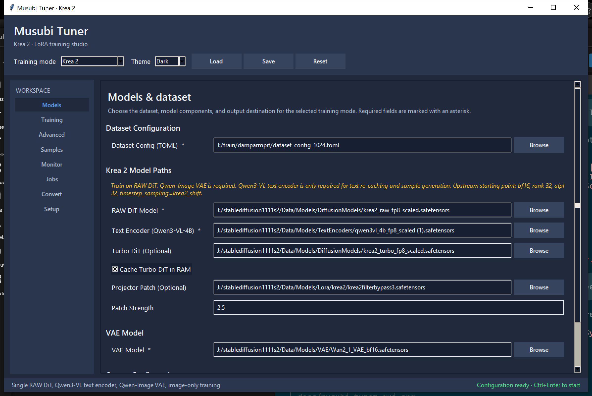

# Musubi Tuner Simple GUI

A Windows-focused desktop GUI for [kohya-ss/musubi-tuner](https://github.com/kohya-ss/musubi-tuner).



This fork is no longer just a Wan 2.2 front-end. The GUI now supports multiple musubi-tuner training flows from one app:

- `Wan 2.2`
- `Flux.2 Klein`
- `Flux.2 Dev`
- `Krea 2`

It keeps the underlying musubi-tuner workflow intact, but makes setup, sampling, monitoring, continuation training, and conversion easier to manage from a single interface.

## What This GUI Adds

- Modern light and dark themes
- Mode-aware forms for different model families
- Dataset, model, and output path management
- Built-in sample prompt editor with enable/disable, duplicate, and test generation support
- Sample gallery with thumbnail previews inside the app
- Live monitor with console, loss graph, VRAM usage, epoch/step counters, and next-epoch progress
- Local job history workspace for finished, failed, and stopped runs
- Save/load settings and auto-restore of your last session
- LoRA conversion tools
- Accelerate setup tab for first-time installation

## Current Workspace Layout

The app is organized into these main pages:

- `Models`
- `Training`
- `Advanced`
- `Samples`
- `Monitor`
- `Jobs`
- `Convert`
- `Setup`

The GUI adjusts required fields and available options based on the selected training mode.

## Supported Modes

### Wan 2.2

- High-noise and low-noise DiT workflows
- Timestep boundary controls
- Combined or split training setups
- Optional low-VRAM strategies such as block swap and offloading

Docs: [docs/wan.md](./docs/wan.md)

### Flux.2 Klein / Dev

- Flux.2 DiT path selection
- Qwen3 or Mistral3 text encoder input
- FP8 text encoder option

Docs: [docs/flux_2.md](./docs/flux_2.md)

### Krea 2

- RAW DiT training
- Optional Turbo DiT sampling path
- Optional projector patch and patch strength
- Krea-specific timestep sampling and prompt controls
- In-app Krea test sample generation

Docs: [docs/krea2.md](./docs/krea2.md)

## Installation

### Requirements

- Windows is the primary target
- Python `3.10+`
- NVIDIA GPU recommended
- Enough VRAM for the model family you plan to train

This GUI is only a front-end. Model requirements and training memory use still depend on musubi-tuner and the selected backend.

### Setup

1. Clone your fork.

```bash
git clone https://github.com/diodiogod/musubi-tuner_simple_GUI.git
cd musubi-tuner_simple_GUI
```

2. Create and activate a virtual environment.

```bash
python -m venv venv
venv\\Scripts\\activate
```

3. Install PyTorch for your CUDA version.

Example for CUDA 12.4:

```bash
pip install torch torchvision --index-url https://download.pytorch.org/whl/cu124
```

4. Install the project.

```bash
pip install -e .
```

5. Install optional monitor/logging extras if you want them.

```bash
pip install matplotlib pynvml tensorboard wandb
```

## Launching

On Windows, use:

```text
LAUNCH_GUI.bat
```

The launcher now closes automatically when the GUI exits normally, and only stays open if startup fails or Python returns an error.

You can also launch directly:

```bash
python musubi_tuner_gui.py
```

## Basic Workflow

1. Prepare your dataset TOML.
2. Open the GUI and choose the training mode.
3. Fill the model paths required for that mode.
4. Set output directory and output name.
5. Configure training rank, alpha, optimizer, precision, and memory settings.
6. Optionally enable latent/text recaching.
7. Add sample prompts in the `Samples` page.
8. Start training from the `Monitor` page.
9. Watch live loss, VRAM, console output, and step/epoch progress.
10. Review finished runs later in the `Jobs` page.

## Notable Features

### Sample Tools

- Save prompt presets without deleting older ones
- Enable only the prompts you want active for a run
- Duplicate a prompt and edit the copy
- Test Krea 2 prompts directly from the GUI
- Preview generated sample images inside the app
- Open a global prompt library with search, tags, collections, favorites, and model filters
- Collect and deduplicate prompts from current settings or historical jobs
- Copy library prompts into a run without creating a live dependency on the library
- Automatically preserve a model-badged library thumbnail after a successful standalone prompt test

The global library is user data, stored outside the repository at
`%APPDATA%\MusubiTuner\prompt_library` on Windows. Each run and job snapshot still stores a
complete copy of its prompts so later library edits cannot change an existing run configuration.

### Job History

The `Jobs` page stores local machine history only. It is intended for day-to-day use, not for committing into the repo.

It records or imports:

- completed runs
- stopped runs
- failed runs
- conversion jobs
- Krea test sample jobs

For imported historical jobs, the GUI tries to recover progress and metadata from:

- saved settings JSON files
- model/state folders
- `wandb-summary.json`
- `output.log`
- log directories

### Continuation Training

The GUI supports both:

- resuming from a full saved training state
- continuing from existing LoRA weights

This is useful for staged training such as `256 -> 512 -> 1024`.

## Documentation

This fork rides on top of upstream musubi-tuner, so the backend documentation is still important.

- Wan: [docs/wan.md](./docs/wan.md)
- Flux.2: [docs/flux_2.md](./docs/flux_2.md)
- Krea 2: [docs/krea2.md](./docs/krea2.md)
- Dataset config: [docs/dataset_config.md](./docs/dataset_config.md)
- Sampling during training: [docs/sampling_during_training.md](./docs/sampling_during_training.md)
- Advanced config: [docs/advanced_config.md](./docs/advanced_config.md)
- LoHa / LoKr notes: [docs/loha_lokr.md](./docs/loha_lokr.md)

## Notes

- This repo is opinionated toward Windows desktop use.
- Some advanced backend capabilities still depend on the upstream CLI behavior.
- Different modes have different model-format requirements. Read the matching backend doc before downloading large checkpoints.

## Credits

- Upstream training backend: [kohya-ss/musubi-tuner](https://github.com/kohya-ss/musubi-tuner)
- This repo builds a GUI workflow around that backend and adds mode-specific UX, sampling, monitoring, and local job tracking.

## License

Same overall licensing direction as the upstream musubi-tuner project. See the repository license files and upstream project for details.
